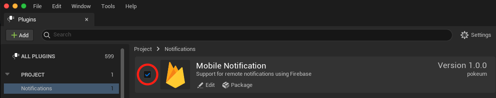

[](https://www.buymeacoffee.com/pokeumcho)

# Mobile Notification

Created a `Mobile Notification` plugin by extending the [`Firebase`](./document/FirebasePlugin.md) provided by Unreal Engine.

## Integrating the Plugin

1. Copy [`demo/Plugins/MobileNotification`](demo/Plugins/MobileNotification) into your own app's Plugin folder.

2. Copy the `MobileNotification` folder into it. You should have something like:
   
   ```
   MyProject
      ├── Plugins
            └── MobileNotification
                  └── MobileNotification.uplugin
   ```

3. If using a C++ Project, configure your module to reference the CustomWebBrowser module. In your *.Build.cs file, add **"MobileNotification"** to your PublicDependencyModuleNames. Ex:
   
    ```csharp
    PublicDependencyModuleNames.AddRange(new string[] { ... , "MobileNotification" });
    ```

4. In a Blueprint Project, enable the plugin by first clicking **Settings** > **Plugins**, scrolling down to Project section of plugins, and clicking **Notifications** > **Mobile Notification**. From there you can tick the Enabled checkbox:

    |  |
    | -- |

## Add a Firebase configuration file

Download and then add the Firebase configuration file to your app:

```
MyProject
   ├── Config
         └── Firebase
               ├── GoogleService-Info.plist
               └── google-services.json
```

## Set Firebase configuration

Update `Config/DefaultEngine.ini` configuration file.

```INI
[Firebase]
FirebaseEnabled=True
;FirebaseService=
;AutoRegisterForRemoteNotificationsEnabled=
ProjectName=MyProject

[/Script/IOSRuntimeSettings.IOSRuntimeSettings]
bEnableRemoteNotificationsSupport=True
```

| Property | Type | Description |
| -- | -- | -- |
| FirebaseEnabled | Bool | Enable Firebase plugin. Default is False so you need to explicitly set it to `True` |
| FirebaseService | String | Set a service that extends FirebaseMessagingService. Default is `com.epicgames.unreal.notifications.EpicFirebaseMessagingService` (Android only) |
| AutoRegisterForRemoteNotificationsEnabled | Bool | Automatically request for notifications permission. Default is False. (iOS only) |
| ProjectName | String | Unreal Engine project name. Default is empty string. (iOS only) |

## Access the FCM registration token

On initial startup of your app, the FCM SDK generates a registration token for the client app instance.

### Retrieve the current registration token

```cpp
#include "MobileNotification.h"

FString Token = UMobileNotification::GetFirebaseToken();
```

### Monitor token generation

- **MyGameMode.h**

   ```cpp
   #include "MobileNotification.h"
   
   UCLASS()
   class AMyGameMode : public AGameModeBase
   {
   public:
      AMyGameMode();
   
   protected:
      virtual void BeginPlay() override;
	
      UFUNCTION()
      void OnTokenRefresh(const FString& Token);
   
      // Register listeners through component
      UPROPERTY()
      UMobileNotificationListener* MobileNotificationListener;

   private:
      void SendRegistrationToServer(const FString& Token);
   };
   ```

- **MyGameMode.cpp**

   ```cpp
   AMyGameMode::AMyGameMode()
   {
      MobileNotificationListener = CreateDefaultSubobject<UMobileNotificationListener>(TEXT("MobileNotificationListener"));
   }

   void AMyGameMode::BeginPlay()
   {
      // Register listeners here
      MobileNotificationListener->OnTokenRefresh.AddDynamic(this, &AMyGameMode::OnTokenRefresh);
      ...
  
      // Activate once after all listeners are registered
      UMobileNotification::ActivateMobileNotificationListener();
   }

   /**
    * Called if the FCM registration token is updated. This is called when the
    * FCM registration token is initially generated so this is where you would
    * retrieve the token.
    */
   void AMyGameMode::OnTokenRefresh(const FString& Token)
   {
      UE_LOG(LogTemp, Display, TEXT("Refreshed token: %s"), *Token);
	
      // If you want to send messages to this application instance or
      // manage this apps subscriptions on the server side, send the
      // FCM registration token to your app server.
      SendRegistrationToServer(Token);
   } 
   ```

After you've obtained the token, you can send it to your app server and store it using your preferred method.

### Delete the registration token

```cpp
#include "MobileNotification.h"

UMobileNotification::DeleteFirebaseToken();
```

## Receive messages

[About FCM messages](./document/FirebaseCloudMessaging.md)

- **MyGameMode.h**

   ```cpp
   #include "MobileNotification.h"
   
   UCLASS()
   class AMyGameMode : public AGameModeBase
   {
   public:
      AMyGameMode();
   
   protected:
      virtual void BeginPlay() override;
	
      UFUNCTION()
      void OnMessageReceived(const FRemoteMessage& RemoteMessage);
   
      // Register listeners through component
      UPROPERTY()
      UMobileNotificationListener* MobileNotificationListener;
   };
   ```

- **MyGameMode.cpp**

   ```cpp
   AMyGameMode::AMyGameMode()
   {
      MobileNotificationListener = CreateDefaultSubobject<UMobileNotificationListener>(TEXT("MobileNotificationListener"));
   }

   void AMyGameMode::BeginPlay()
   {
      // Register listeners here
      MobileNotificationListener->OnMessageReceived.AddDynamic(this, &AMyGameMode::OnMessageReceived);
      ...
  
      // Activate once after all listeners are registered
      UMobileNotification::ActivateMobileNotificationListener();
   }

   void AMyGameMode::OnMessageReceived(const FRemoteMessage& RemoteMessage)
   {
      // Get the message data
      TMap<FString, FString> Data = RemoteMessage.Data;
   } 
   ```

## iOS

### Registering for Notifications

```cpp
#include "MobileNotification.h"

UMobileNotification::RegisterForRemoteNotifications();
```

### Getting the Device Token

```cpp
#include "MobileNotification.h"

FString Token = UMobileNotification::GetDeviceToken();
```
