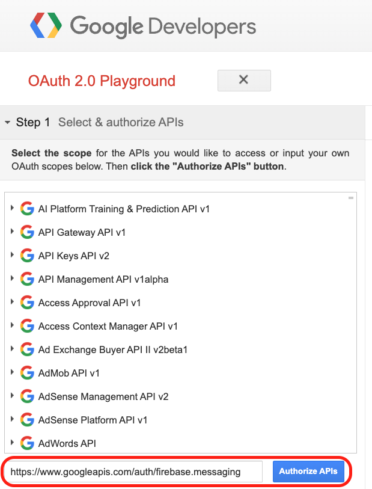
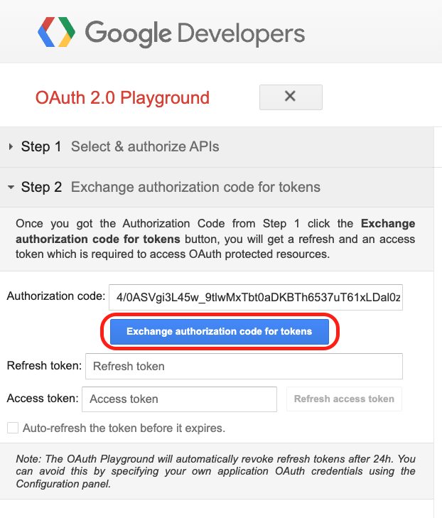
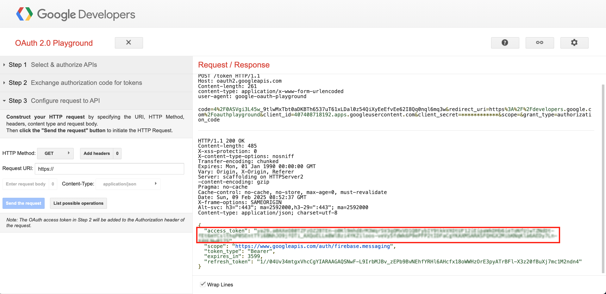

# Firebase Cloud Messaging

## About FCM messages

[](https://firebase.google.com/docs/cloud-messaging/concept-options)

### Notification messages

```json
{
  "message":{
    "token":"bk3RNwTe3H0:CI2k_HHwgIpoDKCIZvvDMExUdFQ3P1...",
    "notification":{
      "title":"Portugal vs. Denmark",
      "body":"great match!"
    }
  }
}
```

- **백그라운드 상태**인 경우 notification의 title과 body 항목대로 알림 메시지가 표시되고, 터치 시 기본적으로 앱을 Launch한다.
- **포그라운드 상태**인 경우 `FirebaseMessagingService#onMessageReceived()` 메서드를 통해 커스터마이징 한대로 동작한다.

### Data messages

```json
{
  "message":{
    "token":"bk3RNwTe3H0:CI2k_HHwgIpoDKCIZvvDMExUdFQ3P1...",
    "data":{
      "Nick":"Mario",
      "body":"great match!",
      "Room":"PortugalVSDenmark"
    }
  }
}
```

- **백그라운드 상태**인 경우 `FirebaseMessagingService#onMessageReceived()` 메서드를 통해 커스터마이징 한대로 동작한다.
- **포그라운드 상태**인 경우 `FirebaseMessagingService#onMessageReceived()` 메서드를 통해 커스터마이징 한대로 동작한다.

### Notification messages with optional data payload

```json
{
  "message":{
    "token":"bk3RNwTe3H0:CI2k_HHwgIpoDKCIZvvDMExUdFQ3P1...",
    "notification":{
      "title":"Portugal vs. Denmark",
      "body":"great match!"
    },
    "data":{
      "Nick":"Mario",
      "Room":"PortugalVSDenmark"
    }
  }
}
```

- **백그라운드 상태**인 경우 notification의 title과 body 항목대로 알림 메시지가 표시되고, 터치 시 기본적으로 앱을 Launch한다.    
  <ins>data payload는 시작 액티비티의 인텐트 추가 항목(_intent.extras_)에 저장된다</ins>.
- **포그라운드 상태**인 경우 `FirebaseMessagingService#onMessageReceived()` 메서드를 통해 커스터마이징 한대로 동작한다.

## iOS Payload

```json
{
  "message":{
    "token":"bk3RNwTe3H0:CI2k_HHwgIpoDKCIZvvDMExUdFQ3P1...",
    "apns":{
      "payload":{
        "aps":{
          ...
        },
        "data_key":"data_value"
      }
    }
  }
}
```

> **iOS JSON payload**
> 
> ```json
> {
>   "aps":{
>     ...
>   },
>   "data_key":"data_value"
> }
> ```

### Background notification

To send a background notification, create a remote notification with an aps dictionary that includes only the `content-available` key, as shown in the sample code below.

```json
{
  "aps":{
    "content-available":1
  },
  ...
}
```

To deliver a background notification, the system wakes your app in the background. On iOS it then calls your app delegate’s `application(_:didReceiveRemoteNotification:fetchCompletionHandler:)` method. 

## FCM HTTP v1 API

1. [Google OAuth Playground](https://developers.google.com/oauthplayground/) 페이지로 이동하여 주세요.
2. "Input your own scopes" 필드에 다음 url을 입력 후, Authorize APIs 버튼을 눌러 주세요.
   
   ```
   https://www.googleapis.com/auth/firebase.messaging
   ```
   
   |  |
   | --- |
   
3. Google 계정 로그인을 진행하여 주세요. "Google OAuth 2.0 Playground wants to access your Google Account" 창이 나오면 Allow 버튼을 눌러주세요.
4. Exchange authorization code for tokens 버튼을 눌러주세요.

   |  |
   | --- |
   
5. Access token 을 복사해주세요.

   |  |
   | --- |
   
6. 다음 명령어를 실행해주세요.

   ```shell
   curl --location --request POST 'https://fcm.googleapis.com/v1/projects/{PUT_YOUR_PROJECT_ID}/messages:send' \
     --header 'Content-Type: application/json' \
     --header 'Authorization: Bearer {PUT_YOUR_ACCESS_TOKEN}' \
     --data-raw '{
       "message":{
         "token":"bk3RNwTe3H0:CI2k_HHwgIpoDKCIZvvDMExUdFQ3P1...",
         "notification":{
           "title":"Portugal vs. Denmark",
           "body":"great match!"
         },
         "data":{
           "Nick":"Mario",
           "Room":"PortugalVSDenmark"
         }
       }
     }'
   ```
