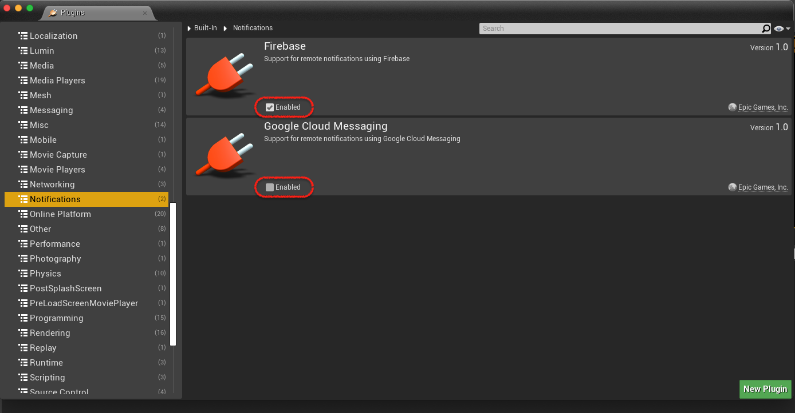

# Built-in Firebase Plugin

| Location | GitHub |
|---|---|
| :file_folder: `/Users/Shared/Epic Games/UE_{VERSION}/Engine/Plugins/Runtime/Firebase` | [master](https://github.com/EpicGames/UnrealEngine/tree/master/Engine/Plugins/Runtime/Firebase) |

## How to use...

🔒 [](https://console.firebase.google.com/project/mobile-notification-e8e8e/overview?hl=ko)

### Android

- **Step 1.** Add firebase project → Add Android App
  
    |  |
    | --- |

- **Step 2.**  Enable `Firebase` plugin and Disable `Google Cloud Messaging` plugin

    |  |
    | --- |

- **Step 3.** Update `DefaultEngine.ini`

    ```ini
    [Firebase]
    FirebaseEnabled=True
    ```

    > **💡 TIP**
    > ```xml
    > <setBoolFromProperty result="bEnabled" ini="Engine" section="Firebase" property="FirebaseEnabled" default="false"/>
    > ```

- **Step 4.** Change Android Package Name

    |  |
    | --- |

- **Step 5.** Move `google-services.json` file to `demo/Intermediate/Android/armv7`

    |  |
    | --- |

    <details>
    <summary>👀 ─── <i>Firebase configuration file</i> ───</summary>

    |  |
    | --- |

    </details>

    > **💡 TIP**
    > ```xml
    > <copyFile
    >   src="$S(BuildDir)/google-services.json"
    >   dst="$S(BuildDir)/gradle/app/google-services.json"
    >   force="false"/>
    > ```    

- **Step 5.** Package Android Project

    |  |
    | --- |

- **Step 8.** Get Firebase token

    |  |
    | --- |
    | `package=:com.example.demo_game` `message:"Firebase token"` |

- **Result**

    |  |
    | --- |

## What's New

### Android

#### v4.27.0

Updated to use [AndroidX](https://developer.android.com/jetpack/androidx) instead of older support libraries.

#### v5.0.0

Change package name from `com.epicgames.ue4` to `com.epicgames.unreal`

#### v5.1.1

- Update firebase version

  - Update **firebase-core** version from `11.8.0` to `21.1.1`
  - Update **firebase-messaging** version from `11.8.0` to `23.0.8`
 
- Remove `EpicFirebaseInstanceIDService`

#### v5.3.0

Updated Google-Services plugin for Firebase. (v`4.0.1` → v`4.3.15`)

#### v5.5.0

Add `FirebaseDisableAutoInit` config variable.

## MobileNotification/Firebase

📂 [`MobileNotification/Source/MobileNotification/Firebase`](../demo/Plugins/MobileNotification/Source/MobileNotification/Firebase)

### Android

| File | Unreal Engine Version |
| -- | -- |
| v4 | 4.26.2-release |
| v5 | 5.1.0-release |
| v5.1.1 | 5.4.4-release |
