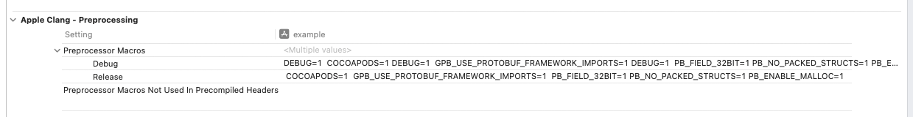
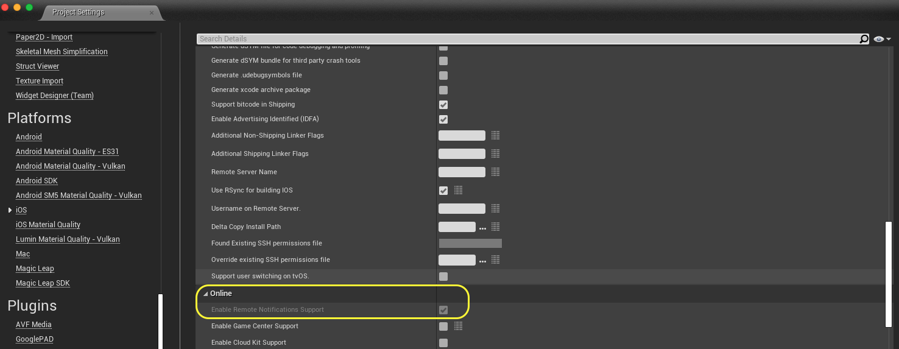

# iOS

[Generating a remote notification](https://developer.apple.com/documentation/usernotifications/generating-a-remote-notification)

## Mobile Notification

- **Auto register for remote notifications**
  
  Add `AUTO_REGISTER_FOR_REMOTE_NOTIFICATIONS=1` macro at:

  |  |
  | --- |

## Firebase Cloud Messaging

[](https://firebase.google.com/docs/cloud-messaging/ios/client)

### CocoaPods

```shell
pod install --repo-update
```

- **Podfile**

  ```
  target 'example' do
  
    use_frameworks!
  
    pod 'Firebase/Core', '5.20.0'
    pod 'Firebase/Messaging', '5.20.0'
  
    # Pinned version for Firebase Messaging
    pod 'Protobuf', '= 3.22.1'
  
  end
  ```

- **Podfile.lock**

  ```
  PODS:
    - Protobuf (3.22.1)
  ```

## Unreal Engine

### UE 4.26.2

#### App Delegate

| source file |
| :-- |
| 📂 `/Users/Shared/Epic\ Games/UE_4.26/Engine/Source/Runtime/ApplicationCore/Private/IOS/IOSAppDelegate.cpp` ([🔗](https://github.com/EpicGames/UnrealEngine/blob/4.26.2-release/Engine/Source/Runtime/ApplicationCore/Private/IOS/IOSAppDelegate.cpp)) | 

<details>
<summary>👀 ─── <i>Unreal Engine File Search Hacks</i> ───</summary>

```shell
find "/Users/Shared/Epic Games/UE_4.26" -type f -name "*AppDelegate*" 2> /dev/null
```

</details>

#### Push Notifications

- [Getting the device token](https://github.com/EpicGames/UnrealEngine/blob/4.26.2-release/Engine/Source/Runtime/ApplicationCore/Private/IOS/IOSAppDelegate.cpp#L1500-L1538)
- [Register for remote notifications](https://github.com/EpicGames/UnrealEngine/blob/4.26.2-release/Engine/Source/Runtime/Core/Private/IOS/IOSPlatformMisc.cpp#L1165-L1199)
  
- `NOTIFICATIONS_ENABLED`

  > _DefaultEngine.ini_
  >
  > ```ini
  > [/Script/IOSRuntimeSettings.IOSRuntimeSettings]
  > bEnableRemoteNotificationsSupport=True
  > ```
  >
  > |  |
  > | --- |

- **iOS entitlements**

  > ```
  > UATHelper: Packaging (iOS): ... --entitlements ...app.xcent
  > ```
  > 
  > ```xml
  > <?xml version="1.0" encoding="UTF-8"?>
  > <!DOCTYPE plist PUBLIC "-//Apple//DTD PLIST 1.0//EN" "http://www.apple.com/DTDs/PropertyList-1.0.dtd">
  > <plist version="1.0">
  >   <dict>
  >     ...
  >     <key>aps-environment</key>
  >     <string>development</string>
  >     ...
  >   </dict>
  > </plist>
  > ```
